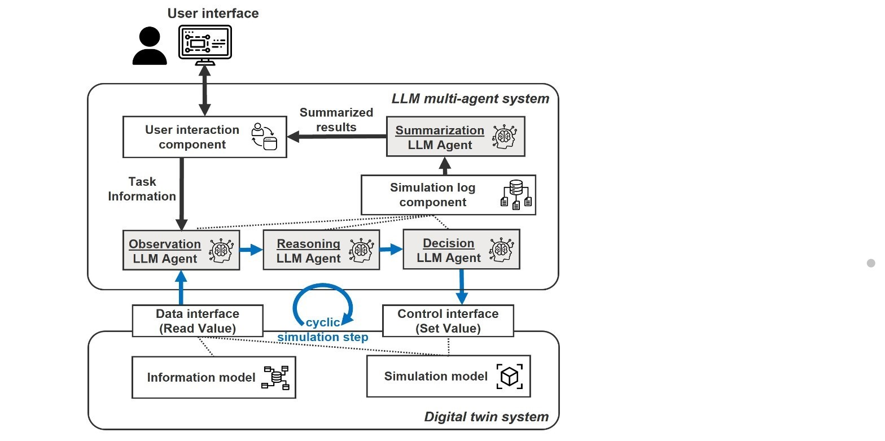
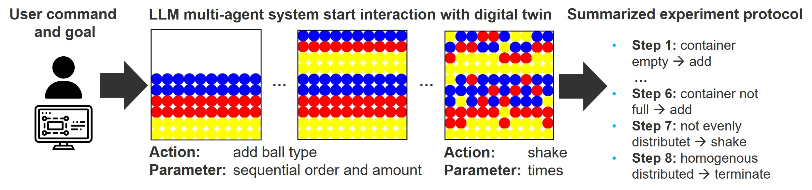

# LLMDrivenSimulation
LLM system interacts with simulation models in digital twins
(work-in-progress, under construction)

## Human performs experiment


## LLM agent performs simulation


## The system design
The LLM interprets the simulation steps in a cyclic manner, interacting with the data and control interface in a digital environment.

---


---
The user provides an objective to the multi-agent system, which then experiments with the simulation to heuristically explore solutions. Finally, the LLM agent provides a summarized solution to parameterize the simulation model.

---


---


---
## Research Paper 
- **Design**: introduces a framework that integrates a multi-agent system with LLMs to interact with a simulation model and find parametrization solutions for a process.
- **Project Status**: it is currently a **work-in-progress** research project and the paper is **under peer-review**.
- **Application Area**: we are investigating the LLMs' interaction with more sophisticated simulation models for **industrial automation systems**.


## Paper Citation
Details of this work has been documented in a pre-print paper, which is currently under review.
>Xia, Y., Dittler, D., Jazdi, N., Chen, H., & Weyrich, M. (2024). LLM experiments with simulation: Large Language Model Multi-Agent System for Process Simulation Parametrization in Digital Twins. https://arxiv.org/abs/2405.18092v1

```bibtex
@misc{xia2024llm,
      title={LLM experiments with simulation: Large Language Model Multi-Agent System for Process Simulation Parametrization in Digital Twins}, 
      author={Yuchen Xia and Daniel Dittler and Nasser Jazdi and Haonan Chen and Michael Weyrich},
      year={2024},
      eprint={2405.18092},
      archivePrefix={arXiv},
      primaryClass={cs.AI}
}
```
